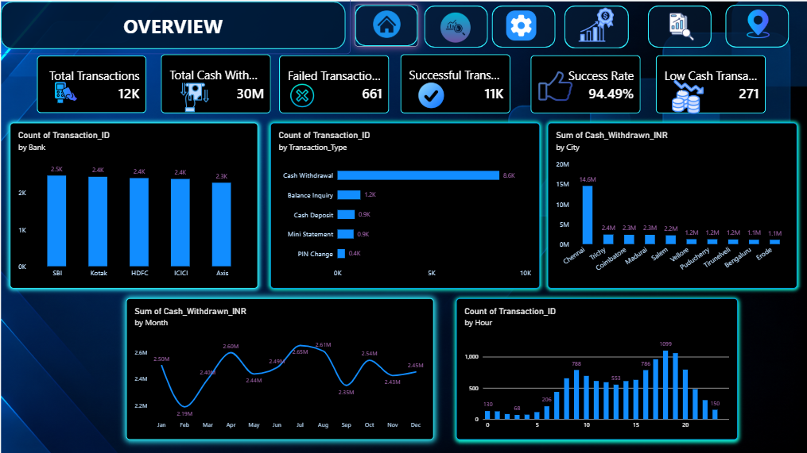
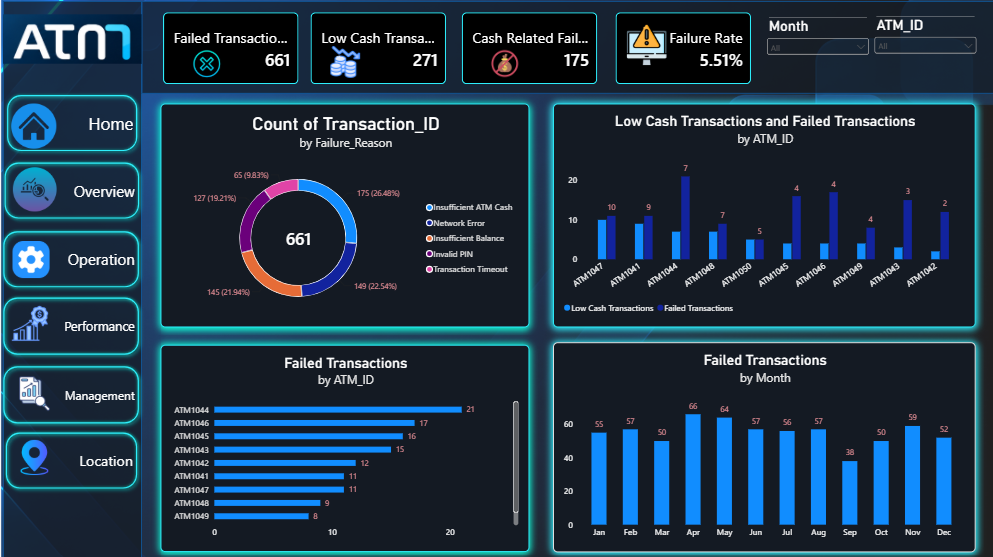
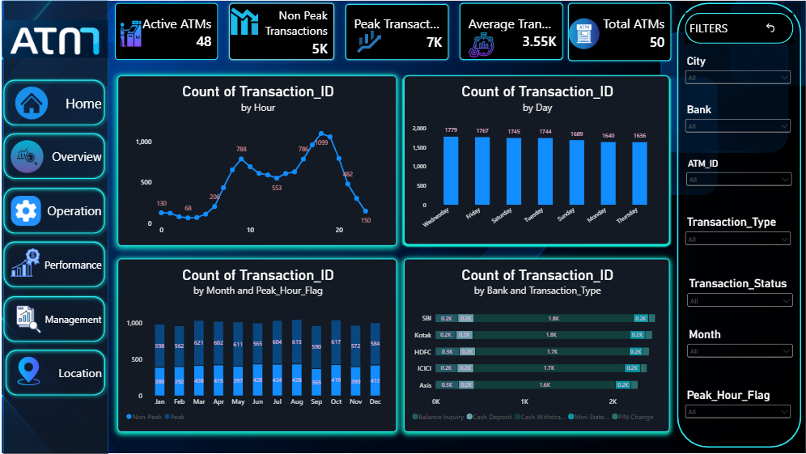
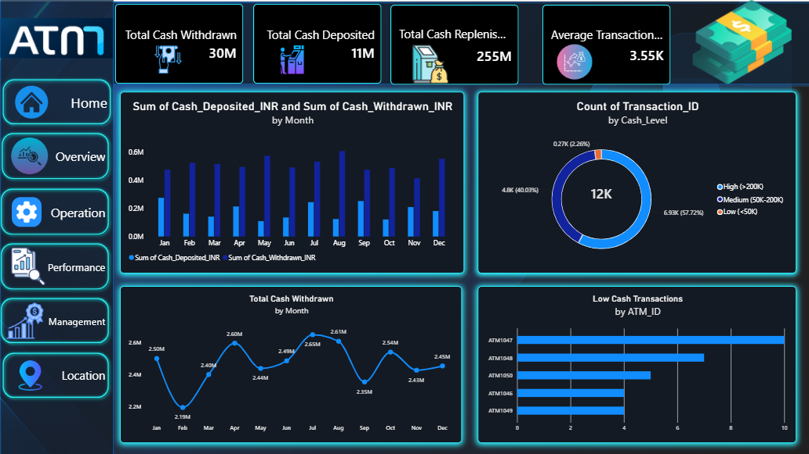
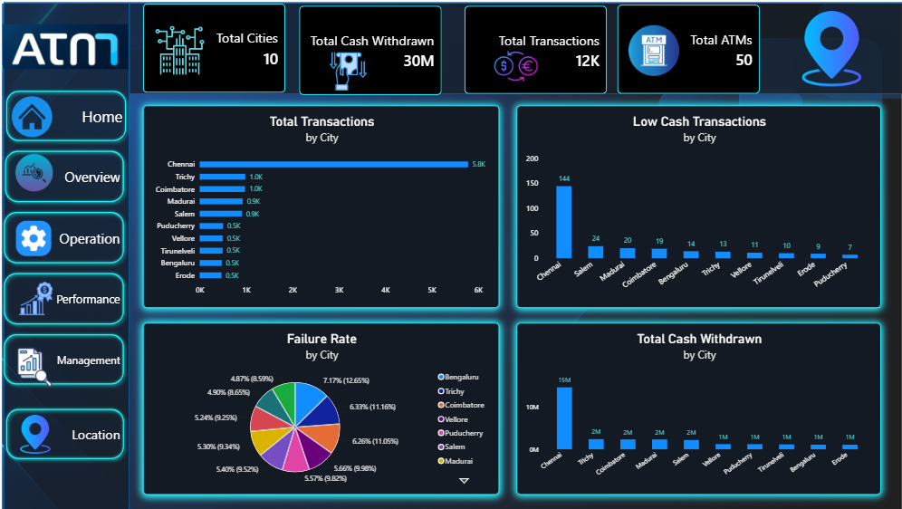

# ATM-Cash-Analytics-360
Power BI dashboard for ATM transaction analysis, cash availability, ATM performance, and operational intelligence.

## 📊 Project Overview

**ATM Cash Analytics 360** is an interactive Power BI dashboard developed to analyze ATM transactions, cash availability, transaction failures, ATM performance, and location-wise activity.

The project transforms ATM transaction data into meaningful business insights using KPIs, interactive charts, filters, and DAX calculations.

### The dashboard helps answer:

- How many ATM transactions are performed?
- How much cash is withdrawn?
- What is the transaction success rate?
- Why do ATM transactions fail?
- Which ATMs experience more failures?
- Which ATMs have low cash availability?
- Which cities have the highest transaction activity?
- When are ATM transactions at their peak?
- How does cash demand change over time?

---

## 🎯 Project Objectives

1. Analyze overall ATM transaction performance.
2. Monitor cash withdrawal and deposit activity.
3. Measure transaction success and failure rates.
4. Identify major transaction failure reasons.
5. Identify ATMs with high failure activity.
6. Monitor low-cash ATM situations.
7. Analyze peak and non-peak transaction behavior.
8. Compare ATM activity across cities and banks.
9. Analyze cash management and replenishment activity.
10. Build an interactive business intelligence dashboard using Power BI.

---

## 🛠️ Tools & Technologies

- **Microsoft Power BI**
- **Power Query**
- **DAX**
- **Microsoft Excel**
- **Data Visualization**
- **Business Intelligence**
- **GitHub**

# 📊 Dashboard Showcase

### 🏠 Home Page

### 📊 Executive Overview

### ⚙️ ATM Operations

### 📈 ATM Performance

### 💰 Cash Management

### 📍 Location Intelligence

---

# 📊 Executive Overview

### KPI Cards

- Total Transactions
- Total Cash Withdrawn
- Average Transaction Amount
- Success Rate
- Failed Transactions
- Low Cash Transactions

### Key Visuals

- Monthly Cash Withdrawal Trend
- Transaction Outcome
- Transactions by Hour
- Cash Withdrawn by City
- Transaction Type Distribution
- Bank-wise Transaction Analysis

---

# ⚙️ ATM Operations

### KPI Cards

- Failed Transactions
- Low Cash Transactions
- Cash Related Failures
- Failure Rate

### Key Visuals

### ❌ Failed Transactions by Failure Reason

Analyzes major failure reasons such as:

- Insufficient ATM Cash
- Network Error
- Insufficient Balance
- Invalid PIN
- Transaction Timeout

### 🏧 Low Cash & Failed Transactions by ATM

Compares low-cash and failed transaction activity across ATMs.

### 📊 Failed Transactions by ATM

Identifies ATMs with higher numbers of failed transactions.

### 📅 Failed Transactions by Month

Shows how transaction failures change over time.

---

# 📈 ATM Performance

### KPI Cards

- Total ATMs
- Active ATMs
- Peak Transactions
- Non-Peak Transactions
- Average Transaction Amount

### Key Visuals

- Transactions by Hour
- Transactions by Day
- Peak vs Non-Peak Transactions
- Bank and Transaction Type Analysis

This page helps understand ATM usage patterns and operating activity.

---

# 💰 Cash Management

### KPI Cards

- Total Cash Withdrawn
- Total Cash Deposited
- Total Cash Replenishment
- Average Transaction Amount

### Key Visuals

- Cash Deposited vs Cash Withdrawn by Month
- Cash Level Distribution
- Total Cash Withdrawn by Month
- Low Cash Transactions by ATM

### Cash Level Categories

- **High Cash:** Above ₹2,00,000
- **Medium Cash:** ₹50,000 – ₹2,00,000
- **Low Cash:** Below ₹50,000

This page helps monitor ATM cash availability and identify ATMs requiring attention.

---

# 📍 Location Intelligence

### KPI Cards

- Total Cities
- Total Cash Withdrawn
- Total Transactions
- Total ATMs

### Key Visuals

- Total Transactions by City
- Low Cash Transactions by City
- Failure Rate by City
- Total Cash Withdrawn by City

This page helps identify high-demand cities and location-wise ATM performance.

---

# 📌 Key Dashboard Metrics

The current dashboard provides approximately:

- **12K+ Total Transactions**
- **30M Total Cash Withdrawn**
- **661 Failed Transactions**
- **94.49% Success Rate**
- **271 Low Cash Transactions**
- **175 Cash-Related Failures**
- **5.51% Failure Rate**
- **50 Total ATMs**
- **48 Active ATMs**
- **10 Cities**
- **7K Peak Transactions**
- **5K Non-Peak Transactions**
- **3.55K Average Transaction Amount**

---

# 🧮 DAX & Analytics

DAX measures are used to calculate important business KPIs such as:

- Total Transactions
- Total Cash Withdrawn
- Average Transaction Amount
- Successful Transactions
- Failed Transactions
- Success Rate
- Failure Rate
- Low Cash Transactions
- Cash Related Failures
- Total Cash Deposited
- Total Cash Replenishment
- Active ATMs
- Total ATMs
- Peak Transactions
- Non-Peak Transactions

🎛️Interactive Filters
The dashboard includes filters for:
- Bank
- City
- ATM ID
- Transaction Type
- Transaction Status
- Month
- Peak Hour Flag
- Low Cash Flag
These filters allow users to explore the dashboard dynamically.
🧹 Data Preparation
The project includes:
- Data cleaning
- Data transformation
- Missing-value checking
- Data type validation
- Column standardization
- DAX calculations
- KPI validation
- Dashboard-ready data preparation
💡 Business Insights
The dashboard helps identify:
- Overall ATM transaction performance
- Transaction success and failure patterns
- Major causes of transaction failures
- ATMs with frequent failures
- ATMs with low cash availability
- Peak transaction periods
- High-demand cities
- Monthly cash withdrawal trends
- ATM operational performance
🔄 Interactive Features
- Multi-page navigation
- Interactive KPI cards
- Slicers and filters
- Cross-filtering
- DAX-driven calculations
- ATM-wise analysis
- City-wise analysis
- Monthly trend analysis
- Conditional formatting
- Interactive Power BI visuals
📷 Dashboard Preview
🏠 Home Page
 
📊 Executive Overview
 
⚙️ ATM Operations
 
📈 ATM Performance
 
💰 Cash Management
 
📍 Location Intelligence
 
📁 Project Files
- ATM Dashboard project.pbix — Power BI dashboard
- ATM_Cash_Analytics_360_12000_Rows.xlsx — Dataset
- Dashboard screenshots
- README.md — Project documentation

🔮 Future Improvements
- Real-time ATM cash monitoring
- ATM location mapping
- Cash-demand forecasting
- ATM failure prediction
- Automated cash replenishment alerts
- Power BI Service automated refresh
- Live database connectivity
- Machine-learning-based ATM failure prediction
- ATM-level drill-through analysis
- 
🧠 Skills Demonstrated
- Power BI
- Power Query
- DAX
- Excel
- Data Cleaning
- Data Transformation
- KPI Development
- Data Visualization
- Business Intelligence
- Dashboard Design
- Interactive Report Navigation
- Exploratory Data Analysis
- Business Problem Solving
- Data Storytelling
  
👩‍💻 Project Information

Project Name: ATM Cash Analytics 360
Project Type: Portfolio Project – Business Intelligence / Data Analytics
Domain: Banking & ATM Analytics
Primary Tool: Microsoft Power BI
Data Source: Microsoft Excel
Focus: ATM Transaction Analysis • Cash Availability • ATM Performance • Operational Intelligence

⭐ Final Summary
ATM Cash Analytics 360 converts ATM transaction data into an interactive business intelligence solution.
The project combines:
Data Preparation + Power Query + DAX + KPI Development + Data Visualization + Dashboard UI/UX
to provide analytical insights across:
Transaction Performance → ATM Operations → ATM Performance → Cash Management → Location Intelligence

## 👩‍💻 Author

**Sivaranjani T**  
🎓 B.E. Electronics and Communication Engineering (ECE)  
💼 **Aspiring Data Analyst**
